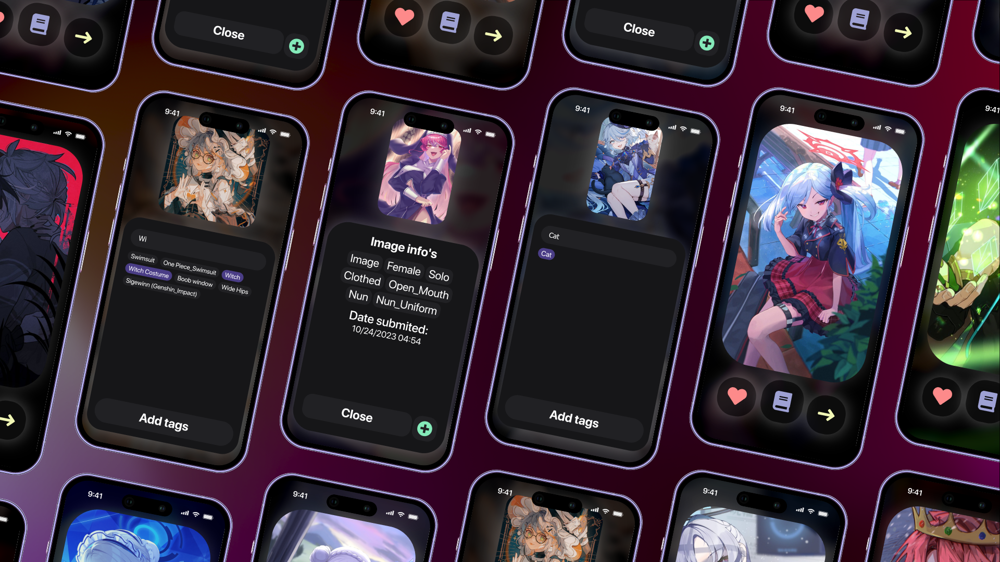
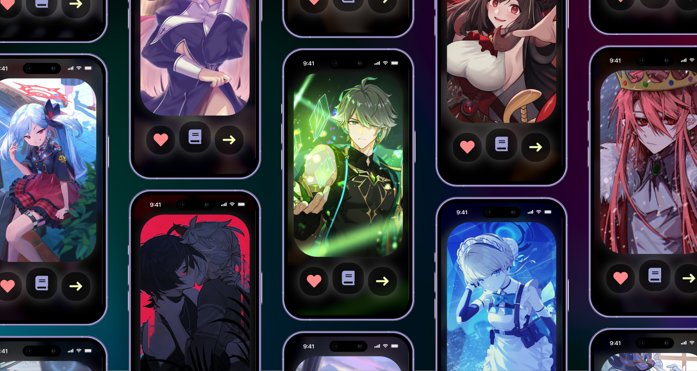

⚠️ Note: All the images used to showcase Amoops are not from the developer. Please refer to [sources.txt](.github/sources.txt) for image sources.
 
 
# 🍵 A quick presentation

## ❓ What is Amoops?
Amoops is a personal image collection server that functions like Gelbooru. With Amoops, you can curate and organize your own collection of images of various kinds, and you have the flexibility to add tags to each image. Please note that it is currently in a pre-alpha stage, so expect potential issues and limitations. Nevertheless, it works seamlessly offline and is entirely free to use.
 
 
### 🤖 What langages Amoops use?

- Golang: Amoops utilizes Golang for the server-side development. Golang is a robust and efficient programming language that ensures the server's performance and reliability.

- JavaScript (JS): JavaScript is employed for client-side scripting, enhancing the user experience by enabling dynamic and interactive features.

- HTML: HTML (Hypertext Markup Language) is used to structure the content of web pages, ensuring a well-organized and accessible user interface.

- CSS: Cascading Style Sheets (CSS) are responsible for the visual design and layout of the website, making it visually appealing and user-friendly.
 
 

# Installation

